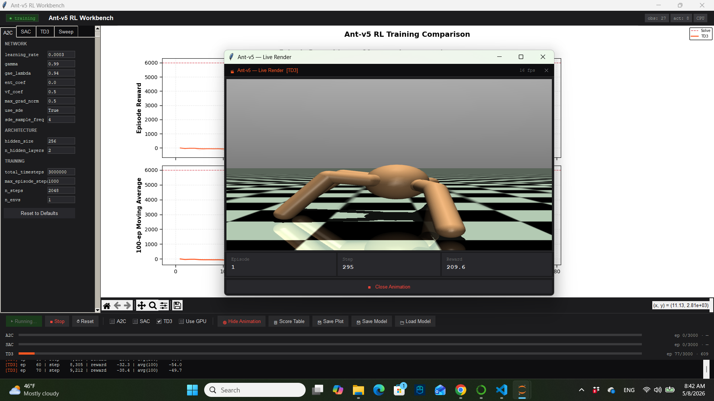
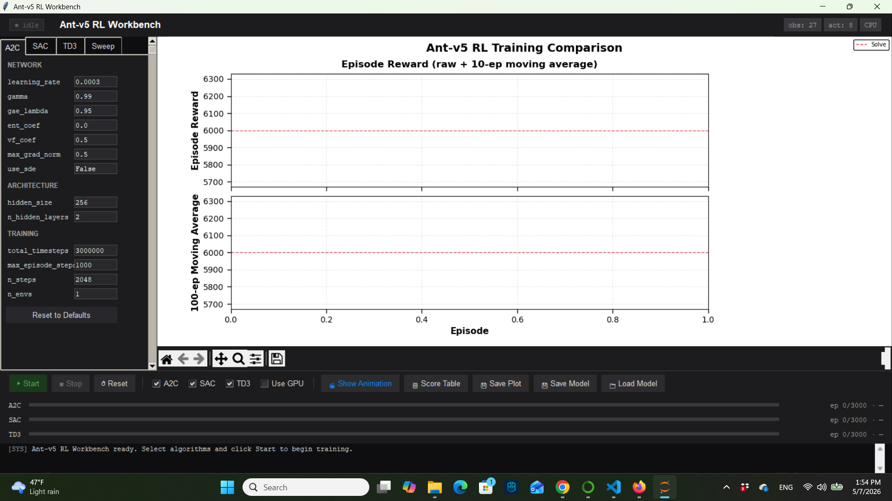
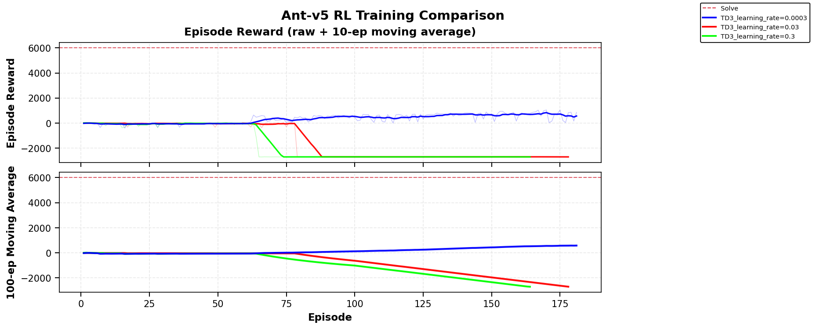
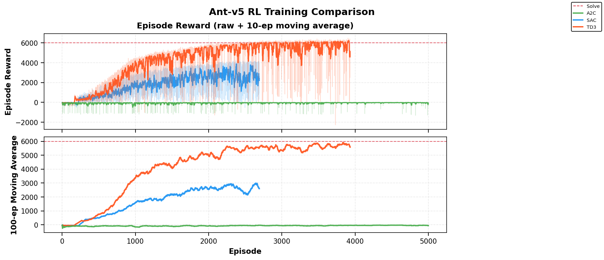
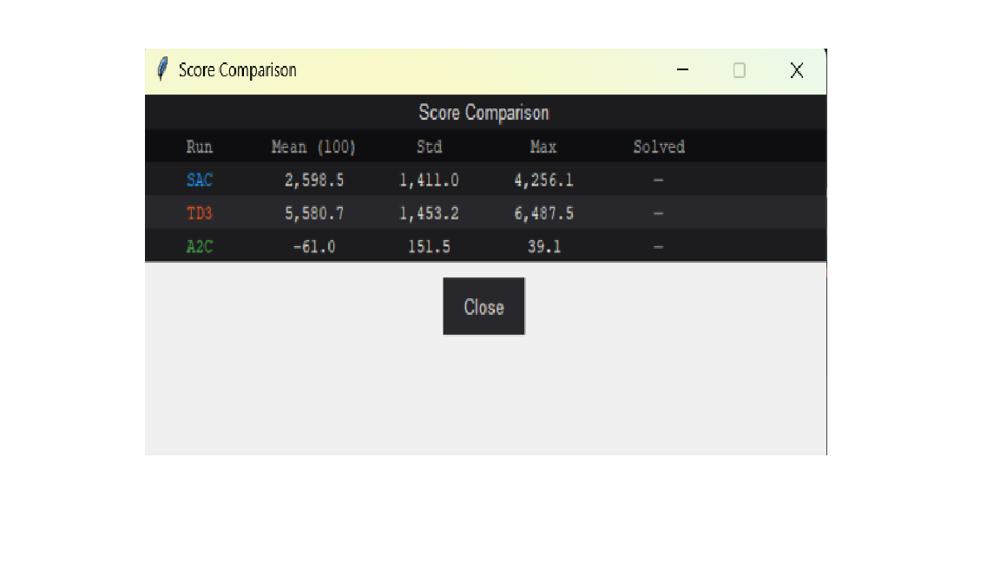

# Project Presentation — Ant-v5 RL Workbench (Stable-Baselines3 Edition)

This file report on my reinforcement learning project, the workbench trains and
compares three algorithms — **A2C**, **SAC**, and **TD3** — using **Stable-Baselines3 (SB3)** on
the `Ant-v5` MuJoCo/Gymnasium environment.  A Tkinter GUI provides full hyperparameter control,
live side-by-side reward charts, per-algorithm progress bars, a live animation popup, a score
comparison table, and **per-algorithm model save/load** so any trained policy can be persisted
and resumed later with different hyperparameters.


---

## Table of Contents

1. [Project Structure](#1-project-structure)
2. [Environment Overview](#2-environment-overview)
3. [Algorithm Overview](#3-algorithm-overview)
4. [Hyperparameter Overview](#4-hyperparameter-reference)
   - 4.1 [A2C](#41-a2c-hyperparameters)
   - 4.2 [SAC](#42-sac-hyperparameters)
   - 4.3 [TD3](#43-td3-hyperparameters)
5. [GUI Architecture](#5-GUI-Architecture)
6. [Solve Criterion](#6-solve-criterion)
7. [Results](#7-Results)
   - 7.1 [Recommanded Hyperparameters](#71-Recommanded-Hyperparameters)
   - 7.2 [Training Curves](#72-Training-Curves)
   
---

## 1. Project Structure

```
ant_workbench/
│
├── project_agent.py            #  entrypoint; run this file
├── ant_ui.py                   #  top-level AntUI frame
│
├── __init__.py                 # empty
│
├── algorithms/
│   ├── __init__.py             # empty
│   ├── base_wrapper.py         #  
│   ├── a2c_wrapper.py          # 
│   ├── sac_wrapper.py          # 
│   ├── td3_wrapper.py          # 
│   └── episode_callback.py     #
│
├── gui/
│   ├── __init__.py             # empty
│   ├── hyperparameter_panel.py # 
│   ├── comparison_panel.py     # 
│   ├── training_panel.py       # 
│   └── animation_window.py     # 
│
└── utils/
    ├── __init__.py             # empty
    ├── device.py               # 
    ├── logger.py               # 
    └── metrics.py              # 
```

Output directories (created automatically at runtime):
- `ant_workbench/results/`        — CSV logs and saved plots
- `ant_workbench/results/models/` — saved model `.zip` files and replay buffers

---

## 2. Environment Overview

### Ant-v5 vs Ant-v4 — key differences

| Property                          | Ant-v4                      | Ant-v5                                               |
|-----------------------------------|-----------------------------|------------------------------------------------------|
| Gymnasium version required        | ≥ 0.26                      | ≥ 1.0.0                                              |
| Default obs\_dim                  | 27                          | **105** (contact forces included by default)         |
| action\_dim                       | 8                           | 8 (unchanged)                                        |
| `include_cfrc_ext_in_observation` | `False` (excluded)          | `True` (included — adds 78 contact-force dims)       |
| `use_contact_forces`              | separate parameter          | Merged into `include_cfrc_ext_in_observation`        |
| Reward shaping                    | velocity + healthy − costs  | Same structure; healthy\_reward default unchanged    |
| `xml_file` parameter              | Not available               | Available — can substitute a custom ant model        |
| `forward_reward_weight`           | Implicit 1.0                | Explicit parameter (default 1.0)                     |

### Environment properties

| Property              | Value                                                                                                       |
|-----------------------|-------------------------------------------------------------------------------------------------------------|
| Gym ID                | `Ant-v5`                                                                                                    |
| Action space          | `Box(-1, +1, (8,), float32)` — 8 joint torques (unchanged from v4)                                         |
| Observation space     | `Box(-∞, +∞, (105,), float64)` — joint pos/vel (27) + contact forces (78) — **read dynamically from env**  |
| obs\_dim              | **105** (default config); always read as `env.observation_space.shape[0]` in code — never hardcode 105      |
| action\_dim           | **8** — always read as `env.action_space.shape[0]`                                                          |
| Reward per step       | `forward_reward_weight × velocity` + `healthy_reward` − `ctrl_cost` − `contact_cost`                       |
| Healthy bonus         | +1.0 per step the ant's z position is in `[0.2, 1.0]`                                                      |
| Solve criterion       | Mean episode reward ≥ 6 000 over the last 100 consecutive episodes                                          |
| Max episode steps     | 1 000 (Gymnasium `TimeLimit` wrapper)                                                                       |
| Termination           | z outside `[0.2, 1.0]` when `terminate_when_unhealthy=True`, or max steps exceeded                          |
| Render modes          | `"human"`, `"rgb_array"`, `None`                                                                            |

## 3. Algorithm Overview

### A2C (Advantage Actor-Critic)
A2C is an on-policy reinforcement learning algorithm that combines policy gradient methods (actor) with value function estimation (critic). It uses the advantage function to reduce variance in policy updates. Training occurs in parallel across multiple environments to collect diverse experiences, making it sample-efficient for continuous control tasks like Ant-v5.

### SAC (Soft Actor-Critic)
SAC is an off-policy algorithm that maximizes both expected return and entropy, encouraging exploration. It uses two Q-networks (soft Q-learning) and a stochastic policy learned via reparameterization. Experiences are stored in a replay buffer for efficient reuse, making it suitable for complex environments with high-dimensional state spaces.

### TD3 (Twin Delayed Deep Deterministic Policy Gradient)
TD3 improves upon DDPG by addressing Q-value overestimation through twin critics and delayed policy updates. It uses deterministic policies with added noise for exploration and target policy smoothing to stabilize training. This makes it effective for continuous action spaces like robotic control in Ant-v5.

## 4. Hyperparameter Reference

All defaults are sourced from the
[SB3 Zoo Ant-v4/v5 tuned hyperparameters](https://github.com/DLR-RM/rl-baselines3-zoo).

---

### 4.1 A2C Hyperparameters

| SB3 / workbench parameter | GUI label           | Default     | Type  | Description                                                    |
|---------------------------|---------------------|-------------|-------|----------------------------------------------------------------|
| `learning_rate`           | learning_rate       | `3e-4`      | float | LR for the combined actor-critic Adam optimizer                |
| `n_steps`                 | n_steps             | `2048`      | int   | Steps collected **per env** per rollout before each update     |
| `gamma`                   | gamma               | `0.99`      | float | Discount factor γ                                              |
| `gae_lambda`              | gae_lambda          | `0.95`      | float | GAE smoothing λ; 1.0 = pure n-step returns                     |
| `ent_coef`                | ent_coef            | `0.0`       | float | Entropy regularisation coefficient                             |
| `vf_coef`                 | vf_coef             | `0.5`       | float | Value-function loss weight                                     |
| `max_grad_norm`           | max_grad_norm       | `0.5`       | float | Gradient clipping norm                                         |
| `normalize_advantage`     | normalize_advantage | `True`      | bool  | **Must be True for Ant-v5** — normalises advantages per batch  |
| `n_envs`                  | n_envs              | `8`         | int   | Number of parallel `SubprocVecEnv` workers                     |
| `hidden_size`             | hidden_size         | `256`       | int   | Units per hidden layer in actor & critic MLPs                  |
| `n_hidden_layers`         | n_hidden_layers     | `2`         | int   | Number of hidden layers                                        |
| —                         | total_timesteps     | `10000000`  | int   | Total env steps across all n\_envs workers                     |
| —                         | max_episode_steps   | `1000`      | int   | Max steps per episode (used to estimate episode count in GUI)  |

---

### 4.2 SAC Hyperparameters

| SB3 parameter   | GUI label         | Default     | Type       | Description                                              |
|-----------------|-------------------|-------------|------------|----------------------------------------------------------|
| `learning_rate` | learning_rate     | `3e-4`      | float      | LR for actor, critics, and α                             |
| `buffer_size`   | buffer_size       | `1000000`   | int        | Replay buffer capacity                                   |
| `learning_starts`| learning_starts  | `10000`     | int        | Env steps before first gradient update                   |
| `batch_size`    | batch_size        | `256`       | int        | Mini-batch size                                          |
| `tau`           | tau               | `0.005`     | float      | Soft target-network update coefficient                   |
| `gamma`         | gamma             | `0.99`      | float      | Discount factor γ                                        |
| `train_freq`    | train_freq        | `1`         | int        | Env steps between gradient cycles                        |
| `gradient_steps`| gradient_steps    | `1`         | int        | Gradient updates per `train_freq` env steps              |
| `ent_coef`      | ent_coef          | `"auto"`    | str/float  | `"auto"` = learnable α; or fixed float                   |
| `target_entropy`| target_entropy    | `"auto"`    | str/float  | `"auto"` = −action\_dim (−8)                             |
| `hidden_size`   | hidden_size       | `256`       | int        | Units per hidden layer                                   |
| `n_hidden_layers`| n_hidden_layers  | `2`         | int        | Number of hidden layers                                  |
| —               | total_timesteps   | `1000000`   | int        | Total env steps (SB3 Zoo: 1e6 sufficient for Ant)        |
| —               | max_episode_steps | `1000`      | int        | Max steps per episode                                    |

---

### 4.3 TD3 Hyperparameters

| SB3 parameter          | GUI label          | Default   | Type  | Description                                              |
|------------------------|--------------------|-----------|-------|----------------------------------------------------------|
| `learning_rate`        | learning_rate      | `3e-4`    | float | LR for actor and both critic networks                    |
| `buffer_size`          | buffer_size        | `1000000` | int   | Replay buffer capacity                                   |
| `learning_starts`      | learning_starts    | `25000`   | int   | Env steps before first gradient update                   |
| `batch_size`           | batch_size         | `256`     | int   | Mini-batch size                                          |
| `tau`                  | tau                | `0.005`   | float | Soft target-network update coefficient                   |
| `gamma`                | gamma              | `0.99`    | float | Discount factor γ                                        |
| `train_freq`           | train_freq         | `1`       | int   | Env steps between gradient updates                       |
| `gradient_steps`       | gradient_steps     | `1`       | int   | Gradient updates per `train_freq` env steps              |
| `policy_delay`         | policy_delay       | `2`       | int   | Actor & target update every N critic steps               |
| `target_policy_noise`  | target_noise       | `0.2`     | float | Std of smoothing noise on target actions                 |
| `target_noise_clip`    | noise_clip         | `0.5`     | float | Max absolute value of smoothing noise                    |
| `exploration_noise`    | exploration_noise  | `0.1`     | float | Std of Gaussian exploration noise                        |
| `hidden_size`          | hidden_size        | `256`     | int   | Units per hidden layer                                   |
| `n_hidden_layers`      | n_hidden_layers    | `2`       | int   | Number of hidden layers                                  |
| —                      | total_timesteps    | `3000000` | int   | Total env steps                                          |
| —                      | max_episode_steps  | `1000`    | int   | Max steps per episode                                    |

---


## 5. GUI Architecture — Detailed Specification
 Overall Layout

```
┌──────────────────────────────────────────────────────────────────────────┐  
│  HEADER BAR  (40 px)                                                     │  
├───────────────────────┬──────────────────────────────────────────────────┤
│                       │                                                  │
│  HyperparamPanel      │  ComparisonPanel                                 │
│  (fixed 270 px wide)  │  (fills remaining width)                         │
│                       │                                                  │
│                       │                                                  │
│                       │                                                  │
├───────────────────────┴──────────────────────────────────────────────────┤
│  BOTTOM BAR  TrainingPanel  (min 190 px)                                 │  
└──────────────────────────────────────────────────────────────────────────┘
```



## 6. Solve Criterion

Solved when the 100-episode rolling mean first reaches ≥ 6 000.

**Expected convergence on GPU (recommended defaults):**

| Algorithm | Total timesteps to solve |  Notes                                    |
|-----------|--------------------------|------------------------------------------|
| SAC       | ~1 000 000               |  Most sample-efficient; auto entropy tuning is key |
| TD3       | ~2 000 000 – 3 000 000   |  Stable but slower than SAC               |
| A2C       | ~8 000 000 – 12 000 000  | Requires n_envs=8 + normalize_advantage  |

## 7. Results
### 7.1 Recommended Hyperparameters

This guide provides the recommended hyperparameters and performance expectations for various reinforcement learning algorithms on the Ant-v5 environment.

## Hyperparameters Finetuning Example
   
## Algorithm Comparison: Recommended Hyperparameters

| Parameter | SAC (Best Overall) | TD3 (Stable) | A2C (Hardest to Tune) |
| :--- | :--- | :--- | :--- |
| **learning_rate** | 3e-4 | 3e-4 | 3e-4 |
| **buffer_size** | 1,000,000 | 1,000,000 | - |
| **learning_starts** | 10,000 | 25,000 | - |
| **batch_size** | 256 | 256 | - |
| **tau** | 0.005 | 0.005 | - |
| **gamma** | 0.99 | 0.99 | 0.99 |
| **train_freq** | 1 | 1 | - |
| **gradient_steps** | 1 | 1 | - |
| **ent_coef** | "auto" | - | 0.0 |
| **target_entropy** | "auto" | - | - |
| **hidden_size** | 256 | 256 | 256 |
| **n_hidden_layers** | 2 | 2 | 2 |
| **total_timesteps** | 1,000,000 | 3,000,000 | 10,000,000 |
| **n_steps** | - | - | 2048 |
| **gae_lambda** | - | - | 0.95 |
| **vf_coef** | - | - | 0.5 |
| **max_grad_norm** | - | - | 0.5 |
| **normalize_advantage** | - | - | True ⚠ |
| **n_envs** | - | - | 8 ⚠ |
| **policy_delay** | - | 2 | - |
| **target_noise** | - | 0.2 | - |
| **noise_clip** | - | 0.5 | - |
| **exploration_noise** | - | 0.1 | - |

---

## Expected Convergence to Solve Threshold (6,000)

| Algorithm | Estimated Steps |
| :--- | :--- |
| **SAC** | ~1M steps |
| **TD3** | ~2–3M steps |
| **A2C** | ≥10M steps* |


---

## Critical Settings Explained

### SAC — Key Decisions
*   **`ent_coef="auto"`**: The single most important setting. It auto-tunes the exploration temperature α using a target entropy of -8 (=-action_dim).
*   **`learning_starts=10000`**: Fills the replay buffer with diverse random transitions before any gradient updates begin — prevents early overfitting.
*   **`total_timesteps=1e6`**: Sufficient per SB3 Zoo. SAC is the most sample-efficient algorithm here.
*   **`gradient_steps=1`**: Conservative. On GPU you can try `gradient_steps=4` for faster wall-time convergence at the cost of more compute per step.

### TD3 — Key Decisions
*   **`learning_starts=25000`**: TD3 uses deterministic actions with additive noise, so it needs more random warm-up than SAC to fill the buffer with adequate coverage.
*   **`policy_delay=2`**: The actor only updates every 2 critic steps, giving the Q-function time to stabilise before the policy chases it.
*   **`exploration_noise=0.1`**: If the ant gets stuck early, try increasing this to `0.2` to encourage more exploration.
*   **`total_timesteps=3e6`**: TD3 needs roughly 2–3× more steps than SAC to reach the same reward on Ant-v5.

### A2C — Critical Warnings
*   **`normalize_advantage=True`**: This SB3 A2C parameter is essential for MuJoCo. Ensure it is added to the wrapper.
*   **`n_envs=8`**: A2C is an on-policy algorithm that needs many parallel environments to gather enough diverse experience per update. A single env will make training too slow and unstable to reach 6,000.
*   **`total_timesteps=10e6`**: A2C may realistically reach 4,000–5,500 with these settings. Consistently reaching 6,000 on Ant-v5 with A2C alone is genuinely difficult and not guaranteed.

### 7.2 Training Curves

*   **Best Performance**: TD3, SAC, while A2C (No learning).
   Based on benchmark studies and common reinforcement learning implementations in environments like MuJoCo Ant, TD3  and SAC are considered top-tier performers, but saying TD3 is consistently better than SAC is not universally true, though it is often more sample-efficient. A2C generally performs worse than both on complex, high-dimensional control tasks like Ant. see for example, [Evaluating Domain Randomization in Deep Reinforcement Learning Locomotion Tasks](https://www.mdpi.com/2227-7390/11/23/4744).

  